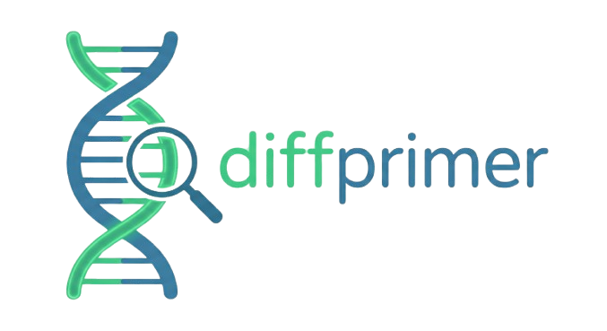

# Welcome to DiffPrimer

<p align="center">
  
</p>

**DiffPrimer** is a robust bioinformatics tool designed to identify **unique genomic regions** in a reference genome compared to a set of other "background" genomes and automatically design **specific PCR primers** for these markers.

It combines high-performance k-mer analysis (written in Rust) with standard primer design tools (Primer3) to generate diagnostic markers that are exclusive to your target organism.

## Key Features

-   **Exclusive Region Discovery**: Efficiently identifies genomic regions present in your reference but absent in a database of other genomes.
-   **Automated Primer Design**: Integrated with **Primer3** to design optimal primer pairs for identified unique regions.
-   **Rigorous Specificity Check**:
    -   Validates designed primers against *all* input background genomes.
    -   Uses a hybrid **Myers Bit-Vector Algorithm** (Global) and **Semiglobal Alignment** (Local) to detect potential off-target amplification, even with insertions/deletions.
-   **Annotation Integration**: Cross-references unique regions with GFF3 annotation files to identify which genes (if any) the markers overlap with.
-   **Parallel Processing**: Fully parallelized core for fast execution on large datasets.

## Functionality

DiffPrimer works in three main stages:

1.  **Region Identification**: It scans the reference genome and subtracts k-mers found in any of the background genomes. Consecutive remaining k-mers form the unique regions.
2.  **Primer Design**: For each unique region, it invokes Primer3 to find the best possible primer pairs based on thermodynamic properties.
3.  **Specificity Verification**: (Optional but recommended) It checks if the designed primers have significant matches in the background genomes to avoid false positives.

## Installation

We recommend using [`uv`](https://github.com/astral-sh/uv) or `pip` in a clean environment.

```bash
# Install with pip
pip install diffprimer
```

For detailed installation instructions, including virtual environment setup and troubleshooting, see the [Introduction](index.md) or check the [README](https://github.com/omatheuspimenta/diffprimer).

## How to Cite

> [!NOTE]
> Citation information is coming soon.

## Contributing

Contributions are welcome! If you find a bug or have a feature request, please open an issue on our [GitHub repository](https://github.com/omatheuspimenta/diffprimer).

Pull requests are also welcome. Please make sure to update tests as appropriate.

